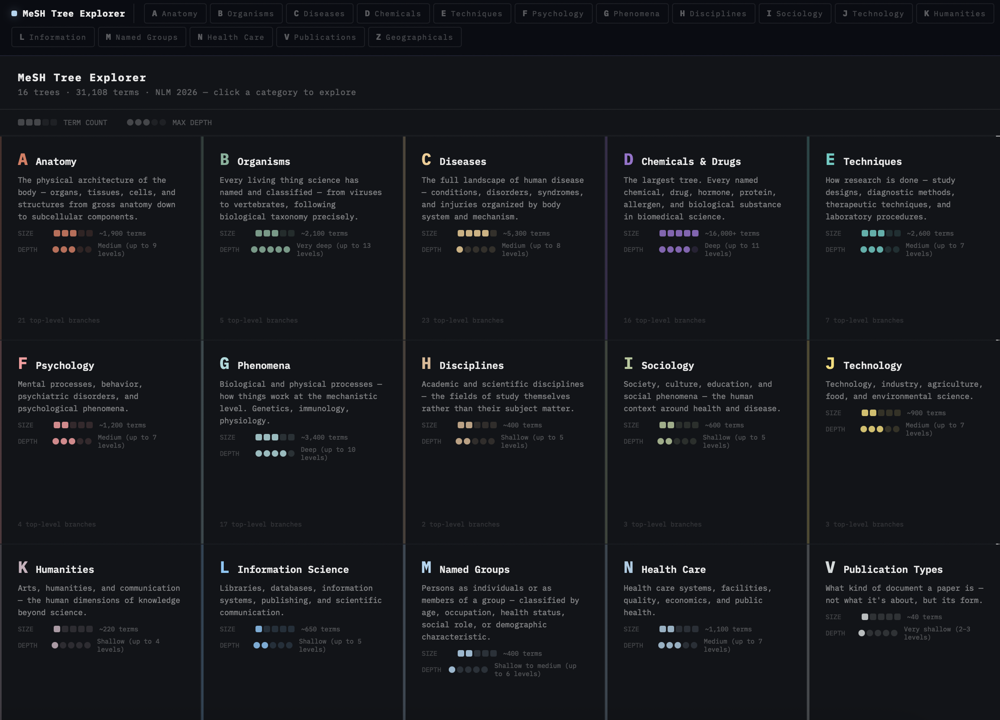

# MeSH Tree Explorer

An interactive prototype for browsing and learning the structure of the
National Library of Medicine's MeSH taxonomy.

Live demo: https://mesh-explorer.pages.dev



## What This Is

MeSH Tree Explorer is a Vite + React app for exploring the major MeSH trees:
Anatomy, Organisms, Diseases, Chemicals and Drugs, Techniques, Psychology,
Phenomena, Disciplines, Named Groups, Health Care, Publication Types,
Geographicals, and related branches.

The current focus is not query construction first. It is helping a user
understand the shape of the MeSH data:

- how trees differ from one another
- how terms nest into hierarchies
- how the same descriptor can appear in multiple placements
- how browsing patterns should adapt to each tree's structure
- how selected terms can later become lightweight PubMed filters

## Current Features

- Tree-specific interfaces instead of one generic browser for everything.
- Global search across representative MeSH terms.
- Persistent query builder shared across pages.
- PubMed links generated from selected MeSH terms.
- Cloudflare Pages deployment.
- Multiple visualization patterns, including:
  - body-map browsing for Anatomy and Diseases
  - map-based browsing for Geographicals
  - DAG views for Chemicals and Drugs
  - expandable tag hierarchies for broad categorical trees
  - lane-based browsing for Named Groups

## Running Locally

Install dependencies:

```bash
npm install
```

Start the dev server:

```bash
npm run dev
```

Build for production:

```bash
npm run build
```

The production build is written to `dist/`.

## Deploying

This project is currently deployed to Cloudflare Pages by direct upload:

```bash
npm run build
npx wrangler pages deploy dist --project-name mesh-explorer --branch main
```

The Cloudflare Pages project is `mesh-explorer`.

## Project Structure

- `src/main.jsx` - app shell, top navigation, shared search state
- `mesh_query_ui.jsx` - global search and shared query builder UI
- `mesh_page_header.jsx` - shared tree header component
- `mesh_a_concepts.jsx` - Anatomy
- `mesh_b_concepts.jsx` - Organisms
- `mesh_c_concepts.jsx` - Diseases
- `mesh_d_concepts.jsx` - Chemicals and Drugs
- `mesh_e_concepts.jsx` - Techniques
- `mesh_f_concepts.jsx` - Psychology and Psychiatry
- `mesh_g_concepts.jsx` - Phenomena and Processes
- `mesh_h_concepts.jsx` - Disciplines and Occupations
- `mesh_i_concepts.jsx` - Anthropology, Education, Sociology, and Social Phenomena
- `mesh_j_concepts.jsx` - Technology, Industry, and Agriculture
- `mesh_k_concepts.jsx` - Humanities
- `mesh_l_concepts.jsx` - Information Science
- `mesh_swimlanes.jsx` - Named Groups
- `mesh_n_concepts.jsx` - Health Care
- `mesh_v_concepts.jsx` - Publication Types
- `mesh_z_concepts.jsx` - Geographicals
- `mesh_cosmos.jsx` - tiled overview page

## Notes On The Data

This is a design and interaction prototype. Some views use curated or partial
MeSH data to explore interface patterns before wiring every tree to complete
source data.

The important design premise is that MeSH is not a single simple tree. It is a
set of hierarchical trees where descriptors can have multiple placements. The
UI should make that structure understandable before asking users to build
queries.

## Longer-Term Direction

The next step is to turn exploration into lightweight PubMed filtering:

- select terms across trees
- mark major or minor topic intent
- open the resulting MeSH query in PubMed
- eventually fetch counts, co-occurring MeSH headings, and publication trends

This started from an interest in comparing biomedical research topics, but the
tool itself is intentionally topic-agnostic.
